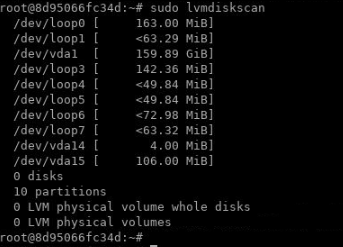
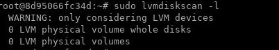

Lab: File and Disk Management Tools
===================================

In this lab, you will learn how to manage your hard disk in Linux.
You will learn how to create new partitions on your drive. Then you will
learn how to create and mount filesystems. Finally, you will learn how
to use LVM to create logical volumes.


Where are your devices?
=======================

A file represents everything in Linux, and
devices are no exception. All your devices are located inside the
[/dev] directory; this includes your keyboard, mouse, terminal,
hard disk, USB devices, CD-ROM, and so on.

If you run the [w] command, you will see the name of the list of devices:

``` 
root@ubuntu-linux:~$ w
```

**Note:** You will get empty list since you are connected with virtual lab environment.

Where is your hard disk?
========================


To know which file represents your hard disk; you need to run the
command [lsblk], which is short for **list block**:

``` 
root@ubuntu-linux:~$ lsblk
```


So from the output of the [lsblk] command, you can conclude that we
only have one disk ([vda]) on my virtual machine.


Logical Volume Manager - LVM
============================


Displaying Information About Physical Volumes, Volume Groups, and Logical Volumes
Accessing information about the various LVM components on your system is essential for managing your physical and logical volumes. LVM provides a number of tools for displaying information about every layer in the LVM stack.

**Install LVM Package**

Install LVM package by running following command in the terminal:

`apt-get install lvm2`


**Displaying Information About All LVM Compatible Block Storage Devices**

To display all of the available block storage devices that LVM can potentially manage, use the lvmdiskscan command:

`sudo lvmdiskscan`




**Displaying Information about Physical Volumes**

A header is written to storage devices to mark them as free to use as LVM components. Devices with these headers are called physical volumes.

You can display all of the physical devices on your system by using lvmdiskscan with the -l option, which will only return physical volumes:

`sudo lvmdiskscan -l`



Note we don't have any physical volume attached with the lab machine.