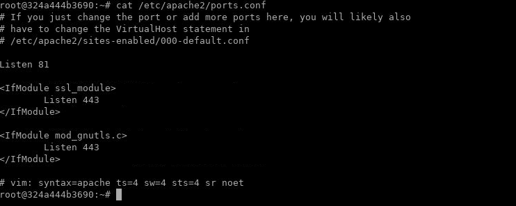
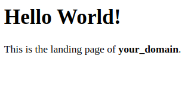
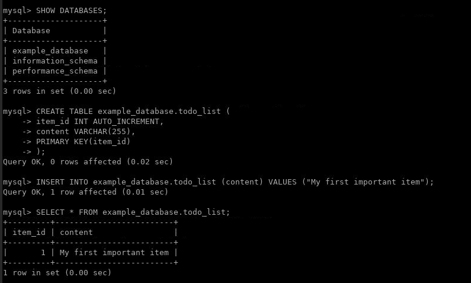

Lab: LAMP Server Basics
=======================


## Step 1 --- Installing Apache and Updating the Firewall

Let's start by updating the package manager cache. If this is the first time
you're using `sudo` within this session, you'll be prompted to provide
your user's password to confirm you have the right privileges to manage
system packages with `apt`.

```
sudo apt update
```


Then, install Apache with:

```
sudo apt install apache2
```


You'll also be prompted to confirm Apache's installation by pressing
`Y`, then `ENTER`.


**Note:** Since port 80 is already in use by lab environment. Make sure that  `/etc/apache2/ports.conf` is updated; port `80` with port `81`.



Let's start apache server and check the apache status by running following commands:

```
service apache2 start

service apache2 status
```


You can do a spot check right away to verify that everything went as
planned by visiting your server's public IP address inside Midori Browser in your lab environment:

    http://localhost:81

You'll see the default Apache web page, which is there for
informational and testing purposes. It should look something like this:


If you see this page, then your web server is now correctly installed
and accessible through your firewall.

### How To Find your Server's Public IP Address

If you do not know what your server's public IP address is, there are a
number of ways you can find it. Usually, this is the address you use to
connect to your server through SSH.

There are a few different ways to do this from the command line. First,
you could use the `iproute2` tools to get your IP address by typing
this:

```
ip addr show eth0 | grep inet | awk '{ print $2; }' | sed 's/\/.*$//'
```


This will give you two or three lines back. They are all correct
addresses, but your computer may only be able to use one of them, so
feel free to try each one.

An alternative method is to use the `curl` utility to contact an outside
party to tell you how *it* sees your server. This is done by asking a
specific server what your IP address is:

```
curl http://ENTER_ABOVE_IP_HERE:81
```


Regardless of the method you use to get your IP address, type it into
your web browser's address bar to view the default Apache page.

## Step 2 --- Installing MySQL

Now that you have a web server up and running, you need to install the
database system to be able to store and manage data for your site. MySQL
is a popular database management system used within PHP environments.

Again, use `apt` to acquire and install this software:

```
sudo apt install mysql-server
```


When prompted, confirm installation by typing `Y`, and then `ENTER`.

After installation, test if you're able to log in to the MySQL console
by typing:

```
sudo mysql
```


This will connect to the MySQL server as the administrative database
user **root**, which is inferred by the use of `sudo` when running this
command. You should see output like this:

    OutputWelcome to the MySQL monitor.  Commands end with ; or \g.
    Your MySQL connection id is 22
    Server version: 8.0.19-0ubuntu5 (Ubuntu)

    Copyright (c) 2000, 2020, Oracle and/or its affiliates. All rights reserved.

    Oracle is a registered trademark of Oracle Corporation and/or its
    affiliates. Other names may be trademarks of their respective
    owners.

    Type 'help;' or '\h' for help. Type '\c' to clear the current input statement.

    mysql> 

To exit the MySQL console, type:


```
exit
```


Your MySQL server is now installed and secured. Next, we'll install PHP,
the final component in the LAMP stack.

## Step 3 --- Installing PHP

You have Apache installed to serve your content and MySQL installed to
store and manage your data. PHP is the component of our setup that will
process code to display dynamic content to the final user. In addition
to the `php` package, you'll need `php-mysql`, a PHP module that allows
PHP to communicate with MySQL-based databases. You'll also need
`libapache2-mod-php` to enable Apache to handle PHP files. Core PHP
packages will automatically be installed as dependencies.

To install these packages, run:

```
sudo apt install php libapache2-mod-php php-mysql
```


Once the installation is finished, you can run the following command to
confirm your PHP version:

```
php -v
```


    OutputPHP 7.4.3 (cli) (built: Jul  5 2021 15:13:35) ( NTS )
    Copyright (c) The PHP Group
    Zend Engine v3.4.0, Copyright (c) Zend Technologies
        with Zend OPcache v7.4.3, Copyright (c), by Zend Technologies

At this point, your LAMP stack is fully operational, but before you can
test your setup with a PHP script, it's best to set up a proper [Apache
Virtual Host](https://httpd.apache.org/docs/current/vhosts/) to hold
your website's files and folders. We'll do that in the next step.

## Step 4 --- Creating a Virtual Host for your Website

When using the Apache web server, you can create *virtual hosts*
(similar to server blocks in Nginx) to encapsulate configuration details
and host more than one domain from a single server. In this lab, we'll
set up a domain called **your_domain**.


Apache has one server block enabled by default that is
configured to serve documents from the `/var/www/html` directory. While
this works well for a single site, it can become unwieldy if you are
hosting multiple sites. Instead of modifying `/var/www/html`, we'll
create a directory structure within `/var/www` for the **your_domain**
site, leaving `/var/www/html` in place as the default directory to be
served if a client request doesn't match any other sites.

Create the directory for **your_domain** as follows:

```
sudo mkdir /var/www/your_domain
```


Next, assign ownership of the directory with the `$USER` environment
variable, which will reference your current system user:

```
sudo chown -R $USER:$USER /var/www/your_domain
```


Then, open a new configuration file in Apache's `sites-available`
directory using your preferred command-line editor. Here, we'll use
`nano`:

```
sudo nano /etc/apache2/sites-available/your_domain.conf
```


This will create a new blank file. Paste in the following bare-bones
configuration:


/etc/apache2/sites-available/your_domain.conf


    <VirtualHost *:81>
        ServerName your_domain
        ServerAlias www.your_domain 
        ServerAdmin webmaster@localhost
        DocumentRoot /var/www/your_domain
        ErrorLog ${APACHE_LOG_DIR}/error.log
        CustomLog ${APACHE_LOG_DIR}/access.log combined
    </VirtualHost>

Save and close the file when you're done. If you're using `nano`, you
can do that by pressing `CTRL+X`, then `Y` and `ENTER`.

With this `VirtualHost` configuration, we're telling Apache to serve
`your_domain` using `/var/www/your_domain` as the web root directory. If
you'd like to test Apache without a domain name, you can remove or
comment out the options `ServerName` and `ServerAlias` by adding a `#`
character in the beginning of each option's lines.

You can now use `a2ensite` to enable the new virtual host:

```
sudo a2ensite your_domain
```


You might want to disable the default website that comes installed with
Apache. This is required if you're not using a custom domain name,
because in this case Apache's default configuration would overwrite your
virtual host. To disable Apache's default website, type:

```
sudo a2dissite 000-default
```


To make sure your configuration file doesn't contain syntax errors, run:

```
sudo apache2ctl configtest
```


Finally, reload Apache so these changes take effect:

```
sudo service apache2 reload
sudo service apache2 start
```


Your new website is now active, but the web root `/var/www/your_domain`
is still empty. Create an `index.html` file in that location so that we
can test that the virtual host works as expected:

```
nano /var/www/your_domain/index.html
```


Include the following content in this file:


/var/www/your_domain/index.html


    <html>
      <head>
        <title>your_domain website</title>
      </head>
      <body>
        <h1>Hello World!</h1>

        <p>This is the landing page of <strong>your_domain</strong>.</p>
      </body>
    </html>

Now go to your browser and access your server's domain name or IP
address once again:

    http://server_domain_or_IP:81

You'll see a page like this:



If you see this page, it means your Apache virtual host is working as
expected.

You can leave this file in place as a temporary landing page for your
application until you set up an `index.php` file to replace it. Once you
do that, remember to remove or rename the `index.html` file from your
document root, as it would take precedence over an `index.php` file by
default.

### A Note About `DirectoryIndex` on Apache

With the default `DirectoryIndex` settings on Apache, a file named
`index.html` will always take precedence over an `index.php` file. This
is useful for setting up maintenance pages in PHP applications, by
creating a temporary `index.html` file containing an informative message
to visitors. Because this page will take precedence over the `index.php`
page, it will then become the landing page for the application. Once
maintenance is over, the `index.html` is renamed or removed from the
document root, bringing back the regular application page.

In case you want to change this behavior, you'll need to edit the
`/etc/apache2/mods-enabled/dir.conf` file and modify the order in which
the `index.php` file is listed within the `DirectoryIndex` directive:

```
sudo nano /etc/apache2/mods-enabled/dir.conf
```


/etc/apache2/mods-enabled/dir.conf


    <IfModule mod_dir.c>
            DirectoryIndex index.php index.html index.cgi index.pl index.xhtml index.htm
    </IfModule>

After saving and closing the file, you'll need to reload Apache so the
changes take effect:

```
sudo service apache2 reload
sudo service apache2 start
```


In the next step, we'll create a PHP script to test that PHP is
correctly installed and configured on your server.

## Step 5 --- Testing PHP Processing on your Web Server

Now that you have a custom location to host your website's files and
folders, we'll create a PHP test script to confirm that Apache is able
to handle and process requests for PHP files.

Create a new file named `info.php` inside your custom web root folder:

```
nano /var/www/your_domain/info.php
```


This will open a blank file. Add the following text, which is valid PHP
code, inside the file:


/var/www/your_domain/info.php


```
<?php
phpinfo();
```


When you are finished, save and close the file.

To test this script, go to your web browser and access your server's
domain name or IP address, followed by the script name, which in this
case is `info.php`:

    http://server_domain_or_IP:81/info.php

You'll see a page similar to this:


This page provides information about your server from the perspective of
PHP. It is useful for debugging and to ensure that your settings are
being applied correctly.

If you can see this page in your browser, then your PHP installation is
working as expected.

After checking the relevant information about your PHP server through
that page, it's best to remove the file you created as it contains
sensitive information about your PHP environment and your server.
You can use `rm` to do so:

```
sudo rm /var/www/your_domain/info.php
```


You can always recreate this page if you need to access the information
again later.

## Step 6 --- Testing Database Connection from PHP

We'll create a database named **example_database** and a user named
**example_user**, but you can replace these names with different values.

First, connect to the MySQL console using the **root** account:

```
sudo mysql
```


To create a new database, run the following command from your MySQL
console:


```
CREATE DATABASE example_database;
```


Now you can create a new user and grant them full privileges on the
custom database you've just created.

The following command creates a new user named `example_user`, using
`mysql_native_password` as default authentication method. We're defining
this user's password as `password`, but you should replace this value
with a secure password of your own choosing.


```
CREATE USER 'example_user'@'%' IDENTIFIED WITH mysql_native_password BY 'password';
```


Now we need to give this user permission over the `example_database`
database:


```
GRANT ALL ON example_database.* TO 'example_user'@'%';
```


This will give the **example_user** user full privileges over the
**example_database** database, while preventing this user from creating
or modifying other databases on your server.

Now exit the MySQL shell with:


```
exit
```


You can test if the new user has the proper permissions by logging in to
the MySQL console again, this time using the custom user credentials:

```
mysql -u example_user -p
```


Notice the `-p` flag in this command, which will prompt you for the
password used when creating the **example_user** user. After logging in
to the MySQL console, confirm that you have access to the
**example_database** database:


```
SHOW DATABASES;
```


This will give you the following output:

    Output+--------------------+
    | Database           |
    +--------------------+
    | example_database   |
    | information_schema |
    +--------------------+
    2 rows in set (0.000 sec)

Next, we'll create a test table named **todo_list**. From the MySQL
console, run the following statement:


```
CREATE TABLE example_database.todo_list (
   item_id INT AUTO_INCREMENT,
   content VARCHAR(255),
   PRIMARY KEY(item_id)
);
```


Insert a few rows of content in the test table. You might want to repeat
the next command a few times, using different values:


```
INSERT INTO example_database.todo_list (content) VALUES ("My first important item");
INSERT INTO example_database.todo_list (content) VALUES ("My second important item");
INSERT INTO example_database.todo_list (content) VALUES ("My third important item");
INSERT INTO example_database.todo_list (content) VALUES ("and this one more thing");
```



To confirm that the data was successfully saved to your table, run:


```
SELECT * FROM example_database.todo_list;
```


You'll see the following output:

    Output+---------+--------------------------+
    | item_id | content                  |
    +---------+--------------------------+
    |       1 | My first important item  |
    |       2 | My second important item |
    |       3 | My third important item  |
    |       4 | and this one more thing  |
    +---------+--------------------------+
    4 rows in set (0.000 sec)

After confirming that you have valid data in your test table, you can
exit the MySQL console:


```
exit
```

Now you can create the PHP script that will connect to MySQL and query
for your content. Create a new PHP file in your custom web root
directory using your preferred editor. We'll use `nano` for that:

```
nano /var/www/your_domain/todo_list.php
```


The following PHP script connects to the MySQL database and queries for
the content of the **todo_list** table, exhibiting the results in a
list. If there's a problem with the database connection, it will throw
an exception. Copy this content into your `todo_list.php` script:


/var/www/your_domain/todo_list.php


```
<?php
$user = "example_user";
$password = "password";
$database = "example_database";
$table = "todo_list";

try {
  $db = new PDO("mysql:host=127.0.0.1;dbname=$database", $user, $password);
  echo "<h2>TODO</h2><ol>"; 
  foreach($db->query("SELECT content FROM $table") as $row) {
    echo "<li>" . $row['content'] . "</li>";
  }
  echo "</ol>";
} catch (PDOException $e) {
    print "Error!: " . $e->getMessage() . "<br/>";
    die();
}
```


Save and close the file when you're done editing.

You can now access this page in your web browser by visiting the domain
name or public IP address configured for your website, followed by
`/todo_list.php`:

    http://your_domain_or_IP:81/todo_list.php

You should see a page like this, showing the content you've inserted in
your test table:


That means your PHP environment is ready to connect and interact with
your MySQL server.

## Conclusion

In this lab, we've built a flexible foundation for serving PHP
websites and applications to your visitors, using Apache as web server
and MySQL as database system.
