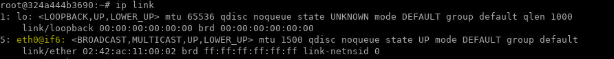
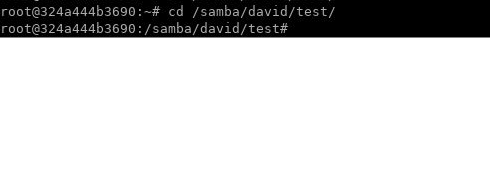

Lab: The Samba File Sharing Facility
====================================


## Step 1 --- Installing Samba

Let's start by installing Samba using Ubuntu's package management
system.

Before installing new packages, let's update the local package index to
include the most up-to-date versions from the Ubuntu repositories:

```
sudo apt-get update
```


Next, install Samba:

```
sudo apt-get install samba
```


This command will install and start both the Samba server `smbd` and the
Samba NetBIOS server `nmbd`. `nmbd` is not required for this lab,
so in the interests of security you can stop and disable it:

```
sudo service nmbd stop
sudo systemctl disable nmbd.service
```


To avoid security issues that can arise from running an unconfigured,
network-enabled service, let's stop the Samba server until configuration
details are in place:

```
sudo service smbd stop
```


Samba is now installed and ready to be configured.

## Step 2 --- Setting Samba's Global Options

Let's define how the Samba server will behave by modifying its
configuration file, located at `/etc/samba/smb.conf`. This file has two
parts: a `[global]` section and a `[shares]` section. The `[global]`
section configures the behavior of the Samba server, and the `[shares]`
sections configure the file shares. Let's begin by setting directives in
the `[global]` section.

Rather than editing `/etc/samba/smb.conf` directly, rename it to
`smb.conf.original` and create a new file with the name `smb.conf`:

```
sudo mv /etc/samba/smb.conf /etc/samba/smb.conf.orig
```


Before editing `/etc/samba/smb.conf`, let's check the available
interfaces in order to tell Samba which it should recognize. Type the
following:

```
ip link
```


    Output1: lo: <LOOPBACK,UP,LOWER_UP> mtu 65536 qdisc noqueue state UNKNOWN mode DEFAULT group default qlen 1
        link/loopback 00:00:00:00:00:00 brd 00:00:00:00:00:00
    2: eth0@if6: <BROADCAST,MULTICAST,UP,LOWER_UP> mtu 1500 qdisc pfifo_fast state UP mode DEFAULT group default qlen 1000
        link/ether 02:21:2c:03:ef:e2 brd ff:ff:ff:ff:ff:ff

This output indicates that `lo` is the loopback interface and `eth0@if6` is
the external network interface, though your external interface may
differ. Take note of both: you'll include them with the `interfaces`
directive in the `[global]` section of the `smb.conf` file.



Let's begin editing this file with `nano` or your favorite editor:

```
sudo nano /etc/samba/smb.conf
```


The `[global]` section of this file will define the server's name, role,
and other details, including network interfaces:


/etc/samba/smb.conf


    [global]
            server string = samba_server
            server role = standalone server
            interfaces = lo add_your_network_interface
            bind interfaces only = yes
            disable netbios = yes
            smb ports = 445
            log file = /var/log/samba/smb.log
            max log size = 10000

These directives specify the following:

-   `server string` - This is the identifying information that will be
    supplied to users during connections. You can use `samba_server` or
    another name that will identify your server. Throughout this
    lab, you will see the string `localhost` to denote the
    Samba share for the organization.
-   `server role` - This defines what type of Samba server will be
    created. In this case it is a `standalone server`, i.e. a file
    share. Other server types include domain member servers and domain
    controllers.
-   `interfaces` - These are the network interfaces that Samba will bind
    to. `lo` is the loopback interface (127.0.0.1) and is required. You
    will also need to include the external network interface you
    outputted earlier. This is usually `eth0@if6`.
-   `bind interfaces only` - This ensures that Samba only binds to the
    interfaces listed on the `interfaces` line. As a security measure,
    this causes Samba to ignore packets that do not correspond to the
    specified `interfaces`.
-   `disable netbios` - This disables all NetBIOS functions that are not
    needed in a standalone server. Doing this simplifies the server name
    resolution process and the transport of SMB traffic.
-   `smb ports` - This sets the port that Samba will listen on. Port
    `445` is the standard port for Samba.
-   `log file` - This sets the name and location of Samba's log file.
-   `max log size` - This sets a size limit on the log file. The number
    listed is in bytes and equals 10MB. Some things to keep in mind when
    setting this size limit: When it is reached, Samba will generate a
    new log file and move the old contents to a duplicate with an `.old`
    extension. If the limit is exceeded again, the existing `.old` file
    will be destroyed. This prevents disk/partition space from being
    overwhelmed with the contents of a single log file. You should
    therefore define a file size that makes sense for your system
    resources.


Save and close the file when you have finished creating this section.

Whenever you edit `smb.conf`, you should run the Samba utility
`testparm` to check that there are no syntax errors:

```
testparm
```


Running the `testparm` command on the `smb.conf` file produces the
following output:

    OutputLoad smb config files from /etc/samba/smb.conf
    Loaded services file OK.
    Server role: ROLE_STANDALONE

    Press enter to see a dump of your service definitions

Pressing `ENTER` produces the following output:

    Output# Global parameters
    [global]
            server string = samba_server
            interfaces = lo add_your_network_interface
            bind interfaces only = Yes
            server role = standalone server
            log file = /var/log/samba/smb.log
            max log size = 10000
            smb ports = 445
            disable netbios = Yes
            idmap config * : backend = tdb

If `testparm` reports `Loaded services file OK.`, then there are no
syntax errors that would stop the Samba server from starting.

Configuring the `[global]` section is all that's required to start the
Samba server. However, its functionality will be limited without share
configurations. A share is comprised of two parts, a user and a
directory, both of which must be created and configured to allow logins
and testing. The next section will explain how to create users that can
access the shares.

## Step 3 --- Creating Users

In this step, we will create users that can access the shares. They will
need access as Samba and system users in order to authenticate with the
Samba server when they log in and read and write to the file system.

In the hypothetical company, there is employee who need to be added to the Samba server and created
as users on the Linux system: **david**. In addition, there will be an **admin** user who
will be able to access and administer the personal shares. This user
will also own the common shares that everyone can access.

The first step to adding system users is creating home directories for
each of them. Rather than using the standard home directories at
`/home/user`, the Samba directories and data will be located at
`/samba/`. Keeping Samba data in a single location and separated from
other user data will make future management tasks such as backups
easier.


**Note:** The users created in this lab are not intended to have SSH
logins. If your users already have accounts on the server, you should
create a dedicated Samba user for them in order to follow this lab.


The next section will explain the process to add the first user,
**david**.
The first step is to create the directory where the Samba data will be
stored, at the root of the file system. This directory will be called
`/samba/`, and its group ownership will be set to `sambashare`, a group
that was created when you installed Samba.

Execute the following commands to create the `/samba/` directory and set
the group ownership to `sambashare`:

```
sudo mkdir /samba/
sudo chown :sambashare /samba/
```


Next, create **david**'s home directory under the `/samba/` directory:

```
sudo mkdir /samba/david
```


Now, add **david** as a system user with the following command:

```
sudo adduser --home /samba/david --no-create-home --shell /usr/sbin/nologin --ingroup sambashare david
```


The options do the following:

-   `--home` - This sets the location of the user's home directory.
-   `--no-create-home` - This stops the `adduser` command from creating
    **david**'s home directory. If the system were to create this
    directory, it would be populated with configuration files such as
    `.bash_history` that are not necessary for the current setup.
-   `--shell`- This sets which shell **david** will be allocated when he
    logs in by SSH. An SSH login is not needed for access to a Samba
    share; setting this to `/usr/sbin/nologin` will disable SSH logins.
-   `--in-group sambashare` - This adds the user to the `sambashare`
    group, giving them read and write access to their own shares and to
    the common share.

You will be prompted for a password when you run this command. Choose a
unique, non-dictionary based password of 10 characters or more.

Now that the system user **david** exists, you can set the ownership and
permissions on his Samba home directory:

```
sudo chown david:sambashare /samba/david/
sudo chmod 2770 /samba/david/
```


Setting the permissions of the directory to `2770` means that new files
or directories created under `/samba/david/` will inherit the group
ownership of the parent directory rather than the primary group of the
user that created the file or directory. This means, for example, that
if the **admin** user were to create a new directory in **david**'s
share, **david** would be able to read and write to it.

Next, add **david** to the Samba server. Samba keeps its own database of
users and passwords, which it uses to authenticate logins. In order to
log in, all users must be added to the Samba server and enabled. Execute
the following `smbpasswd` commands to accomplish both of these tasks:

```
sudo smbpasswd -a david
sudo smbpasswd -e david
```


The options used here do the following:

-   `-a` - This adds the user to the Samba server without enabling them.
-   `-e` - This enables a previously-added user.

The password that you enter here will be used to access the Samba share,
and can differ from the system password.

The user **david** now exists as a system user without the ability to
SSH into the server. He has a home directory at `/samba/david`, and is
registered and enabled as a Samba user.

To create the **admin** user, run through the following commands,
changing the home directory to `/samba/everyone/`:

```
sudo mkdir /samba/everyone
sudo adduser --home /samba/everyone --no-create-home --shell /usr/sbin/nologin --ingroup sambashare admin
sudo chown admin:sambashare /samba/everyone/
sudo chmod 2770 /samba/everyone/
sudo smbpasswd -a admin
sudo smbpasswd -e admin
```


In addition to creating the **admin** user, let's create a group called
**admins** to make the management of the server easier. With read and
write permissions to each share, this group can simplify the work of
adding and deleting users. For example, if individual users function as
**admin** users and then leave the organization, they need to be
individually removed from each share. New administrators also need to be
manually added to every share. Creating an **admins** group and giving
this group read-write access to the shares means adding and removing
users requires only a single command.

Execute the following commands to create a new group called **admins**
and add the user **admin** to this group:

```
sudo groupadd admins
sudo usermod -G admins admin
```


Additional users can be added to the **admins** group by running the
second command, `sudo usermod -G admins admin`, and substituting another
user in place of `admin`.

The system configurations are now complete, with the organization users set as system and Samba
users. Let's move on to configuring the Samba server so these users can
access their share directories.

## Step 4 --- Configuring the Samba Shares

Each share will have its own section in the main Samba configuration
file, `/etc/samba/smb.conf`, following the global parameters. These
sections will define how each share will work.

Use the `nano` text editor again to open and edit this file:

```
sudo nano /etc/samba/smb.conf
```


The following configuration block will define each user's personal
share:


/etc/samba/smb.conf


    ...
    [share_name]
            path =
            browseable =
            read only =
            force create mode =
            force directory mode =
            valid users =

These options include:

-   `share_name` - This is the name of the share that you will use when
    logging in.
-   `path` - This is the absolute path to the share in the filesystem.
-   `browsable` - This sets whether or not other users are able to see
    the share. Enabling this option only allows other users of the Samba
    server to see the existence of the share. It does not confer any
    read or write permissions.
-   `read only` - This sets whether the `valid users` are able to write
    to the share.
-   `force create mode` - This forces the permissions for any file
    written to the share.
-   `force directory mode` - This forces the permissions for any
    directory created in the share.
-   `valid users` - This is a list of the users who have access to the
    share. This setting can take usernames or system groups such as
    **admins**. Groups must be listed with an `@` in front e.g.
    `@admins`.

Add the following share configuration block for **david**, defining his
home directory, the permissions for this directory's group ownership,
and the users that should have access to his share:


/etc/samba/smb.conf


    [david]
            path = /samba/david
            browseable = no
            read only = no
            force create mode = 0660
            force directory mode = 2770
            valid users = david @admins

Note that the directory permissions set the group ownership to that of
the parent directory.

The `[everyone]` share will differ from the others in both `[name]`,
`path`, `valid users`, and `browsable` options, and will look like this:


/etc/samba/smb.conf


    ...
    [everyone]
            path = /samba/everyone
            browseable = yes
            read only = no
            force create mode = 0660
            force directory mode = 2770
            valid users = @sambashare @admins

Giving the `sambashare` group read-write access to the share enables all
of the users access to the share, since they were added to this group
when they were created.

The complete `smb.conf` file will look like this:


/etc/samba/smb.conf


    [global]
            server string = samba_server
            server role = standalone server
            interfaces = lo add_your_network_interface
            bind interfaces only = yes
            disable netbios = yes
            smb ports = 445
            log file = /var/log/samba/smb.log
            max log size = 10000

    [david]
            path = /samba/david
            browseable = no
            read only = no
            force create mode = 0660
            force directory mode = 2770
            valid users = david @admins

    [everyone]
            path = /samba/everyone
            browseable = yes
            read only = no
            force create mode = 0660
            force directory mode = 2770
            valid users = @sambashare @admins

Save and close the file when you have finished editing.

Test the configuration again:

```
testparm
```


This will produce output that looks like the following:

    OutputLoad smb config files from /etc/samba/smb.conf
    Loaded services file OK.
    Server role: ROLE_STANDALONE

    Press enter to see a dump of your service definitions

With the configuration check complete, let's start the Samba server:

```
sudo service smbd start

sudo service smbd status
```


The Samba server is now running and ready to accept logins. The next
step is to log into the Samba server to test that it is working as
expected. The following section will cover logging into the Samba server
from Windows, Linux, and macOS.

## Step 5 --- Logging Into the Samba Server

In this section, we will cover how to access the Samba shares we created
from Linux, Windows, and macOS.

### Linux --- The Command Line

You can use a tool called `smbclient` to access Samba from the command
line. This package is not included by default on most Linux
distributions, so you will need to install it with your local package
manager.

On Debian and Ubuntu servers install `smbclient` with the following
command:

```
sudo apt-get update
sudo apt-get install smbclient
```

`smbclient` uses the following format to access Samba shares:

```
smbclient //localhost/share -U username
```


You can use either your server's IP or the hostname you defined in
`/etc/samba/smb.conf` to access the share. This example uses the
hostname `localhost` to access **david**'s share on the Samba
server you created in the previous steps:

```
smbclient //localhost/david -U david
```


If **david** wants access to the common share (`everyone`), change the
command to:

```
smbclient //localhost/everyone -U david
```


After running the `smbclient` command, you will be prompted for the
Samba password and logged into a command line interface reminiscent of
the FTP text interface:

    smb: \>

This interface is most useful for testing usernames and passwords and
read-write access. For example, you can create a directory and list its
contents as follows:


```
mkdir test
ls
```


You should see the following output:

    Output  .                                   D        0  Fri Feb  2 14:49:01 2018
      ..                                  D        0  Wed Jan 24 12:11:33 2018
      test                                D        0  Fri Feb  2 14:49:01 2018


**Note** You can confirm that folder was created as shown below in ther new terminal:




Remove the directory in the smbclient terminal by typing:

```
rmdir test
```


## Conclusion

In this lab, you have created cross-platform online file shares
using the Samba server. You have also accessed these shares using linux client.
