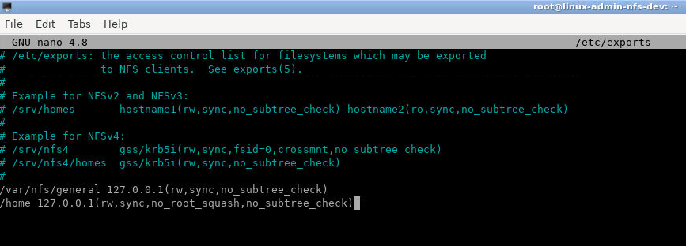
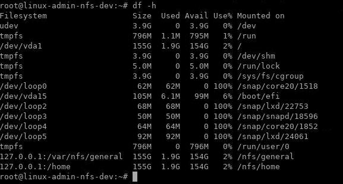

Lab: Networked File Systems (NFS)
=================================

In this lab, we refer to the server that shares its
directories as the **host** and the server that mounts these directories
as the **client**.

In this lab, we will refer to host and client IP addresses by the
placeholders `host_ip` and `client_ip`.

**Note: We will use IP Address `127.0.0.1` for both `host_ip` and `client_ip`. And both client and host commands must be run in the lab environment.**

## Step 1 --- Downloading and Installing the Components

We'll begin by installing the necessary components on each server.

### On the Host

On the **host** server, install the `nfs-kernel-server` package, which
will allow you to share your directories. Since this is the first
operation that you're performing with `apt` in this session, refresh
your local package index before the installation:

```
sudo apt update
sudo apt install nfs-kernel-server
```

Once these packages are installed, switch to the **client** server.

### On the Client

On the **client** server, we need to install a package called
`nfs-common`, which provides NFS functionality without including any
server components. Again, refresh the local package index prior to
installation to ensure that you have up-to-date information:


```
sudo apt update
sudo apt install nfs-common
```


Now that both servers have the necessary packages, we can start
configuring them.

## Step 2 --- Creating the Share Directories on the Host

We're going to share two separate directories, with different
configuration settings, in order to illustrate two key ways that NFS
mounts can be configured with respect to superuser access.

### Example 1: Exporting a General Purpose Mount

In the first example, we'll create a general-purpose NFS mount that uses
default NFS behavior to make it difficult for a user with root
privileges on the **client** machine to interact with the **host** using
those **client** superuser privileges. You might use something like this
to store files which were uploaded using a content management system or
to create space for users to easily share project files.

First, make the share directory:


```
sudo mkdir /var/nfs/general -p
```


Since we're creating it with `sudo`, the directory is owned by the
**host**'s **root** user:


```
ls -la /var/nfs/general
```


    Outputdrwxr-xr-x 2 root root 4096 May 14 18:36 .

NFS will translate any **root** operations on the **client** to the
`nobody:nogroup` credentials as a security measure. Therefore, we need
to change the directory ownership to match those credentials.


```
sudo chown nobody:nogroup /var/nfs/general
```


You're now ready to export this directory.

### Example 2: Exporting the Home Directory

In our second example, the goal is to make user home directories stored
on the **host** available on **client** servers, while allowing trusted
administrators of those **client** servers the access they need to
conveniently manage users.

To do this, we'll export the `/home` directory. Since it already exists,
we don't need to create it. We won't change the permissions, either. If
we *did*, it could lead to a range of issues for anyone with a home
directory on the **host** machine.

## Step 3 --- Configuring the NFS Exports on the Host Server

Next, we'll dive into the NFS configuration file to set up the sharing
of these resources.

On the **host** machine, open the `/etc/exports` file in your text
editor with **root** privileges:


```
sudo nano /etc/exports
```


We'll need to create a line for each of the directories that we plan to
share. We have changed the `client_ip` placeholder shown here to your
actual IP address:

File Path: `/etc/exports`

```
/var/nfs/general 127.0.0.1(rw,sync,no_subtree_check)
/home 127.0.0.1(rw,sync,no_root_squash,no_subtree_check)
```



When you are finished making your changes, save and close the file.
Then, to make the shares available to the clients that you configured,
restart the NFS server with the following command:


```
sudo service nfs-kernel-server restart
```


Before you can actually use the new shares, however, you'll need to be
sure that traffic to the shares is permitted by firewall rules.


## Step 4 --- Creating Mount Points and Mounting Directories on the Client

Now that the **host** server is configured and serving its shares, we'll
prepare our **client**.

In order to make the remote shares available on the **client**, we need
to mount the directories on the **host** that we want to share to empty
directories on the **client**.


We'll create two directories for our mounts:


```
sudo mkdir -p /nfs/general
sudo mkdir -p /nfs/home
```


Now that we have a location to put the remote shares and we've opened
the firewall, we can mount the shares using the IP address of our
**host** server:


```
sudo mount 127.0.0.1:/var/nfs/general /nfs/general
sudo mount 127.0.0.1:/home /nfs/home
```


These commands will mount the shares from the host computer onto the
**client** machine. You can double-check that they mounted successfully
in several ways. You can check this with a `mount` or `findmnt` command,
but `df -h` provides a more readable output:


```
df -h
```




Both of the shares we mounted appear at the bottom. Because they were
mounted from the same file system, they show the same disk usage. To see
how much space is actually being used under each mount point, use the
disk usage command `du` and the path of the mount. The `-s` flag
provides a summary of usage rather than displaying the usage for every
file. The `-h` prints human-readable output.

For example:


```
du -sh /nfs/home
```


```
Output 4.0K  /nfs/home
```

This shows us that the contents of the entire home directory is using
only 36K of the available space.

## Step 5 --- Testing NFS Access

Next, let's test access to the shares by writing something to each of
them.

### Example 1: The General Purpose Share

First, write a test file to the `/var/nfs/general` share:


```
sudo touch /nfs/general/general.test
```


Then, check its ownership:


```
ls -l /nfs/general/general.test
```


```
Output-rw-r--r-- 1 nobody nogroup 0 Aug  1 13:31 /nfs/general/general.test
```

Because we mounted this volume without changing NFS's default behavior
and created the file as the **client** machine's **root** user via the
`sudo` command, ownership of the file defaults to `nobody:nogroup`.
**client** superusers won't be able to perform typical administrative
actions, like changing the owner of a file or creating a new directory
for a group of users, on this NFS-mounted share.

### Example 2: The Home Directory Share

To compare the permissions of the General Purpose share with the Home
Directory share, create a file in `/nfs/home` the same way:


```
sudo touch /nfs/home/home.test
```


Then look at the ownership of the file:


```
ls -l /nfs/home/home.test
```


```
Output-rw-r--r-- 1 root root 0 Aug  1 13:32 /nfs/home/home.test
```

We created `home.test` as **root** using the `sudo` command, exactly the
same way we created the `general.test` file. However, in this case it is
owned by **root** because we overrode the default behavior when we
specified the `no_root_squash` option on this mount. This allows our
**root** users on the **client** machine to act as **root** and makes
the administration of user accounts much more convenient. At the same
time, it means we don't have to give these users root access on the
**host**.

## Step 6 --- Unmounting an NFS Remote Share

If you no longer want the remote directory to be mounted on your system,
you can unmount it by moving out of the share's directory structure and
unmounting, like this:


```
cd ~
sudo umount /nfs/home
sudo umount /nfs/general
```


Take note that the command is named `umount` not `unmount` as you may
expect.

This will remove the remote shares, leaving only your local storage
accessible:


```
df -h
```


```
udev            3.9G     0  3.9G   0% /dev
tmpfs           796M  1.1M  795M   1% /run
/dev/vda1       155G  1.9G  154G   2% /
tmpfs           3.9G     0  3.9G   0% /dev/shm
tmpfs           5.0M     0  5.0M   0% /run/lock
tmpfs           3.9G     0  3.9G   0% /sys/fs/cgroup
/dev/loop0       62M   62M     0 100% /snap/core20/1518
/dev/vda15      105M  6.1M   99M   6% /boot/efi
/dev/loop2       68M   68M     0 100% /snap/lxd/22753
/dev/loop3       50M   50M     0 100% /snap/snapd/18596
/dev/loop4       64M   64M     0 100% /snap/core20/1852
/dev/loop5       92M   92M     0 100% /snap/lxd/24061
tmpfs           796M     0  796M   0% /run/user/0
```


## Conclusion

In this lab, we created an NFS host and illustrated some key NFS
behaviours by creating two different NFS mounts, which we shared with a
NFS client.
