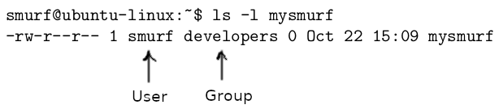

Controlling the Population

Linux is a multiuser operating system, which means that many users are
allowed to access the system at the same time. In real life, you barely
find a Linux server with just one user. On the contrary, you see a lot
of users on one server. So let\'s get real and populate our system with
various users and groups. In this lab, you will learn how to add
users and groups to your Linux system. You will also learn how to manage
user and group accounts in all sorts of ways. Furthermore, you will also
learn how to manage Linux file permissions.


The /etc/passwd file
====================

Every line in [/etc/passwd] consists of 7 fields, each separated
by a colon, and each field represents a user attribute. For example, the
entry for user [elliot] will look something like this:


The following table breaks down those seven fields in
[/etc/passwd] and explains each one of them:


Adding users
============


Before you can add a user on your system, you have to become
[root]:

``` 
elliot@ubuntu-linux:~$ su - 
Password:
root@ubuntu-linux:~#
```

Now, we are ready to add users. We all love Tom & Jerry, so let\'s begin
by adding user [tom]. To do that, you need to run the command
[useradd -m tom]:

``` 
root@ubuntu-linux:~# useradd -m tom
```

And just like that, the user [tom] is now added to our system. You
will also see a new line added to the end of the [/etc/passwd]
file for the new user [tom]; let\'s view it with the lovely
[tail] command:

``` 
root@ubuntu-linux:~# tail -n 1 /etc/passwd 
tom:x:1007:1007::/home/tom:/bin/sh
```

We used the [-m] option with the [useradd] command to ensure
that a new home directory will be created for user [tom]. So
let\'s try to change to the [/home/tom] directory to make sure
it\'s indeed created:

``` 
root@ubuntu-linux:~# cd /home/tom 
root@ubuntu-linux:/home/tom# pwd
/home/tom
```

Awesome! We verified that [/home/tom] is created.

The first thing you may want to do after creating a new user is to set
the user\'s password. You can set [tom]\'s password by running the
command [passwd tom]:

``` 
root@ubuntu-linux:~# passwd tom 
Enter new UNIX password:
Retype new UNIX password:
passwd: password updated successfully
```

Now, let\'s create user [jerry]. But this time, we will choose the
following attributes for user [jerry]:

```
UID       [777]
Comment   [Jerry the Mouse]
Shell     [/bin/bash]
```

This is easy to do with the [useradd] command:

``` 
root@ubuntu-linux:~# useradd -m -u 777 -c "Jerry the Mouse" -s /bin/bash jerry
```

The [-u] option is used to set the UID for [jerry]. We also
used the [-c] option to add a comment for user [jerry], and
finally we used the [-s] option to set the default shell for
[jerry].

Now, let\'s view the last two lines of the [/etc/passwd] file to
make some comparisons:

``` 
root@ubuntu-linux:~# tail -n 2 /etc/passwd 
tom:x:1007:1007::/home/tom:/bin/sh 
jerry:x:777:1008:Jerry the Mouse:/home/jerry:/bin/bash
```

Notice how the comment field for user [tom] is empty as we didn\'t
add any comments while creating user [tom], and notice how the UID
for user [tom] was chosen by the system, but we have chosen
[777] for user [jerry]. Also, notice that the default shell
for user [tom] is chosen by the system to be [/bin/sh],
which is an older version of [/bin/bash]. However, we chose the
newer shell [/bin/bash] for user [jerry].

Now, let\'s set the password for user [jerry]:

``` 
root@ubuntu-linux:~# passwd jerry 
Enter new UNIX password:
Retype new UNIX password:
passwd: password updated successfully
```

Amazing! We have now created two users: [tom] and [jerry].
Now, let\'s switch to user [tom]:

``` 
root@ubuntu-linux:~# su - tom
$ whoami 
tom
$ pwd
/home/tom
$
```

We were able to switch to user [tom], but as you can see, the
shell looks so much different as the command prompt doesn\'t display the
username or the hostname. That\'s because the default shell for user
[tom] is [/bin/sh]. You can use the [echo \$SHELL]
command to display the user\'s default shell:

``` 
$ echo $SHELL
/bin/sh
```

As you can see, it displayed [/bin/sh]. Now, let\'s exit and
switch to user [jerry]:

``` 
$ exit
root@ubuntu-linux:~# su - jerry 
jerry@ubuntu-linux:~$ whoami 
jerry
jerry@ubuntu-linux:~$ echo $SHELL
/bin/bash
```

Everything looks better with user [jerry] as we did set his
default shell to be [/bin/bash]. Alright, now let\'s switch back
to the [root] user:

``` 
jerry@ubuntu-linux:~$ exit 
logout
root@ubuntu-linux:~#
```


Modifying user attributes
=========================


So we are not happy that the default shell for user [tom] is
[/bin/sh], and we want to change it to [/bin/bash]. We can
use the [usermod] command to modify user attributes.

For example, to change the default shell for user [tom] to be
[/bin/bash], you can run the command [usermod -s /bin/bash
tom]:

``` 
root@ubuntu-linux:~# usermod -s /bin/bash tom
```

Notice that you can also use the full name for the command option; so
you can use [\--shell] instead of [-s]. Anyways, let\'s see
if we successfully changed the default shell for user [tom]:

``` 
root@ubuntu-linux:~# su - tom 
tom@ubuntu-linux:~$ whoami 
tom
tom@ubuntu-linux:~$ echo $SHELL
/bin/bash
```

Great! We successfully did it. You can also change the UID of
[tom] to [444] by running the command [usermod -u 444
tom]:

``` 
root@ubuntu-linux:~# usermod -u 444 tom
```

And we can indeed check that the UID of [tom] has changed by
taking a peek at the [/etc/passwd] file:

``` 
root@ubuntu-linux:~# tail -n 2 /etc/passwd 
tom:x:444:1007::/home/tom:/bin/bash 
jerry:x:777:1008:Jerry the Mouse:/home/jerry:/bin/bash
```

We can even modify the comment field of user [tom]. Right now,
it\'s empty, but you can set the comment field of user [tom] to
[\"Tom the Cat\"] by running the command:

``` 
root@ubuntu-linux:~# usermod --comment "Tom the Cat" tom
```

And again, we can verify that the comment is changed by looking at the
[/etc/passwd] file:

``` 
root@ubuntu-linux:~# tail -n 2 /etc/passwd 
tom:x:444:1007:Tom the Cat:/home/tom:/bin/bash 
jerry:x:777:1008:Jerry the Mouse:/home/jerry:/bin/bash
```


Defining the skeleton
=====================


If you list the contents of [/home/jerry] and [/home/tom],
you will see that they are empty:

``` 
root@ubuntu-linux:~# ls -l /home/tom 
total 0
root@ubuntu-linux:~# ls -l /home/jerry 
total 0
```

The reason that both [/home/jerry] and [/home/tom] are empty
is that the skeleton file [/etc/skel] is also empty:

``` 
root@ubuntu-linux:~# ls -l /etc/skel 
total 0
```


**WHAT IS /etc/skel?**

This is the skeleton file. Any file or directory you create in
[/etc/skel] will be copied to the home directory of any new user
created.


Now, with your favorite text editor, create the file [welcome.txt]
in [/etc/skel] and insert the line [\"Hello Friend!\"] in
it:

``` 
root@ubuntu-linux:/etc/skel# ls 
welcome.txt
root@ubuntu-linux:/etc/skel# cat welcome.txt 
Hello Friend!
```

Alright, so now you have created the file [welcome.txt] in
[/etc/skel], which means that any new user created will now have
the file [welcome.txt] in their home directory. To demonstrate,
let\'s create a new user named [edward] and then we will take a
peek at his home directory:

``` 
root@ubuntu-linux:~# useradd -m -c "Edward Snowden" -s /bin/bash edward
```

Now, let\'s set the password for user [edward]:

``` 
root@ubuntu-linux:~# passwd edward 
Enter new UNIX password:
Retype new UNIX password:
passwd: password updated successfully
```

Now, the moment of truth comes! Let\'s switch to user [edward] and
list the contents of his home directory:

``` 
root@ubuntu-linux:~# su - edward 
edward@ubuntu-linux:~$ ls 
welcome.txt
edward@ubuntu-linux:~$ cat welcome.txt 
Hello Friend!
```

You can see that the file [welcome.txt] is copied to
[edward]\'s home directory. Every new user created on the system
will now have a cool greeting message! Notice that old users like
[tom] and [jerry] will not have the file [welcome.txt]
in their home directory as they were created before we added the file
[welcome.txt] in [/etc/skel].


Changing the defaults
=====================


We are too tired of specifying the default shell every time we create a
new user. But luckily, there is a file where you can specify the default
shell for any new user created. This amazing file is
[/etc/default/useradd].

Open up the file [/etc/default/useradd] and look for the following
line:

``` 
SHELL=/bin/sh
```

Change it to:

``` 
SHELL=/bin/bash
```

Awesome! Now, any new user created will have [/bin/bash] as the
default shell. Let\'s test it by creating a new user named [spy]:

``` 
root@ubuntu-linux:~# useradd -m spy
```

Now, set the password for user [spy]:

``` 
root@ubuntu-linux:~# passwd spy 
Enter new UNIX password:
Retype new UNIX password:
passwd: password updated successfully
```

Finally, let\'s switch to user [spy] and check the default shell:

``` 
root@ubuntu-linux:~# su - spy 
spy@ubuntu-linux:~$ echo $SHELL
/bin/bash
spy@ubuntu-linux:~$ exit 
logout
root@ubuntu-linux:~#
```

Hooray! We can see that [bash] is the default shell for user
[spy].

Keep in mind that [/bin/sh] and [/bin/bash] are not the only
two valid shells on your system; there are more! Check out the file
[/etc/shells] to see a complete list of all the valid shells on
your system:

``` 
root@ubuntu-linux:~# cat /etc/shells 
# /etc/shells: valid login shells
/bin/sh
/bin/bash
/bin/rbash
/bin/dash
```

You can change other user defaults in [/etc/default/useradd],
including:

-   The default [home] directory ([HOME=/home])
-   The default [skel] directory ([SKEL=/etc/skel])

I will leave that for you to do as an exercise.


Removing users
==============


Sometimes a user is no longer needed to be on the system, for example,
an employee leaving the company or a user that only needed temporary
access to a server. In any case, you need to know how to delete users.

The last user we created was [spy], right? Well, we don\'t need
any spies on our system, so let\'s delete the user [spy]; you can
delete user [spy] by running the command [userdel spy]:

``` 
root@ubuntu-linux:~# userdel spy
```

And just like that, user [spy] is deleted. However, the home
directory of [spy] still exists:

``` 
root@ubuntu-linux:~# ls -ld /home/spy
drwxr-xr-x 2 1008 1010 4096 Apr 17 10:24 /home/spy
```

We would have to manually delete it:

``` 
root@ubuntu-linux:~# rm -r /home/spy
```

But this is inconvenient. Imagine after every user you delete, you then
have to go and manually remove their home directory. Luckily, there is a
better solution; you can use the [-r] option to automatically
remove the user\'s home directory.

Let\'s give it a try with user [edward]:

``` 
root@ubuntu-linux:~# userdel -r edward
```

Now, let\'s check to see if the home directory for user [edward]
still exists:

``` 
root@ubuntu-linux:~# ls -ld /home/edward
ls: cannot access '/home/edward': No such file or directory
```

And as you can see, [edward]\'s home directory is removed.


The /etc/group file
===================

A group is a collection of users who share the same role or purpose.

Adding groups
=============


Let\'s create a group named [cartoon]. To do that, you need to run
the command [groupadd cartoon]:

``` 
root@ubuntu-linux:~# groupadd cartoon
```

Notice that a new line with the group information will be added to the
end of the file [/etc/group]:

``` 
root@ubuntu-linux:~# tail -n 1 /etc/group 
cartoon:x:1009:
```

Notice that the group [cartoon] currently has no members, and
that\'s why the fourth field is currently empty.

Let\'s create another group named [developers], but this time, we
will specify a GID of [888]:

``` 
root@ubuntu-linux:~# groupadd --gid 888 developers
```

Let\'s check the [developers] group entry in [/etc/group]:

``` 
root@ubuntu-linux:~# tail -n 1 /etc/group 
developers:x:888:
```

And it looks just like we expect it to be. Cool!


Adding group members
====================


Users [tom] and [jerry] are both cartoon characters, so it
makes sense to add them both to the [cartoon] group.

To add [tom] to the [cartoon] group, you simply run the
command [usermod -aG cartoon tom]:

``` 
root@ubuntu-linux:~# usermod -aG cartoon tom
```

Likewise, you can add [jerry] to the [cartoon] group:

``` 
root@ubuntu-linux:~# usermod -aG cartoon jerry
```

Now, let\'s have a peek at the [/etc/group] file:

``` 
root@ubuntu-linux:~# tail -n 2 /etc/group 
cartoon:x:1009:tom,jerry 
developers:x:888:
```

As you can see, both [tom] and [jerry] are now listed as
members of the [cartoon] group.

You can use the [id] command to view the group memberships of any
user on the system. For example, if you want to check which groups
[tom] belongs to, you can run the command [id tom]:

``` 
root@ubuntu-linux:~# id tom
uid=444(tom) gid=1007(tom) groups=1007(tom),1009(cartoon)
```

Let\'s do some more practice by creating three new users --
[sara], [peter], and [rachel]:

``` 
root@ubuntu-linux:~# useradd -m sara 
root@ubuntu-linux:~# useradd -m peter 
root@ubuntu-linux:~# useradd -m rachel
```

And remember to set the password for each user:

``` 
root@ubuntu-linux:~# passwd sara 
Enter new UNIX password:
Retype new UNIX password:
passwd: password updated successfully 
root@ubuntu-linux:~# passwd peter 
Enter new UNIX password:
Retype new UNIX password:
passwd: password updated successfully 
root@ubuntu-linux:~# passwd rachel 
Enter new UNIX password:
Retype new UNIX password:
passwd: password updated successfully 
root@ubuntu-linux:~#
```

Now imagine if all the three new users are software developers; this
means that they have the same role, and so they should be members of the
same group. So let\'s add all three users to the [developers]
group:

``` 
root@ubuntu-linux:~# usermod -aG developers sara 
root@ubuntu-linux:~# usermod -aG developers peter 
root@ubuntu-linux:~# usermod -aG developers rachel
```

Now, let\'s have a peek at the [/etc/group] file:

``` 
root@ubuntu-linux:~# tail -n 5 /etc/group 
cartoon:x:1009:tom,jerry 
developers:x:888:sara,peter,rachel 
sara:x:1001:
peter:x:1002: 
rachel:x:1003:
```

We can see that the group [developers] now has the three members
-- [sara], [peter], and [rachel]. But there is
something strange! It seems like when we have created the users
[sara], [peter], and [rachel], it also created them as
groups! But why did this happen? Well, let me explain it to you in the
next section.


Primary versus secondary groups
===============================

Primary versus secondary groups difference will become crystal clear by the end of
this lab.

Let\'s create a new user named [dummy]:

``` 
root@ubuntu-linux:~# useradd -m dummy
```

Now, if you look at the last line of the [/etc/group] file, you
will see that a group named [dummy] is also created:

``` 
root@ubuntu-linux:~# tail -n 1 /etc/group 
dummy:x:1004:
```

This [dummy] group is the primary group of user [dummy]; and
if you run the [id] command on user [dummy]:

``` 
root@ubuntu-linux:~# id dummy
uid=1004(dummy) gid=1004(dummy) groups=1004(dummy)
```

You will see that user [dummy] is indeed a member of the
[dummy] group. Now, let\'s add user [dummy] to the
[cartoon] group:

``` 
root@ubuntu-linux:~# usermod -aG cartoon dummy
```

Let\'s run the [id] command on user [dummy] again:

``` 
root@ubuntu-linux:~# id dummy
uid=1004(dummy) gid=1004(dummy) groups=1004(dummy),1009(cartoon)
```

You can see that user [dummy] is a member of two groups:
[dummy] and [cartoon]. However, [dummy] is the primary
group and [cartoon] is the secondary group.

The primary group is always preceded by [gid=] in the output of
the [id] command:


Now let\'s add user [dummy] to the [developers] group:

``` 
root@ubuntu-linux:~# usermod -aG developers dummy
```

Next, run the [id] command on user [dummy] again:

``` 
root@ubuntu-linux:~# id dummy
uid=1004(dummy) gid=1004(dummy) groups=1004(dummy),1009(cartoon),888(developers)
```

As you can see, user [dummy] is a member of two secondary groups:
[cartoon] and [developers].

Alright! Enough with all this dummy stuff. Let\'s remove the user
[dummy]:

``` 
root@ubuntu-linux:~# userdel -r dummy
```

Every user must be a member of only one primary group; however, there
are no restrictions on the choice of the primary group!

To demonstrate, let\'s create a user named [smurf] with
[cartoon] being the primary group of user [smurf]. This can
easily be done by using the [\--gid] option with the
[useradd] command:

``` 
root@ubuntu-linux:~# useradd -m --gid cartoon smurf
```

Now, take a peek at the [/etc/group] file:

``` 
root@ubuntu-linux:~# tail -n 1 /etc/group 
rachel:x:1003:
```

You will see that there is no group created with the name [smurf].
Amazing! That\'s because we already specified another primary group for
user [smurf].

Now let\'s check user [smurf]\'s group memberships:

``` 
root@ubuntu-linux:~# id smurf
uid=1004(smurf) gid=1009(cartoon) groups=1009(cartoon)
```

As you can see, [smurf] is only a member of the group
[cartoon], which is also his primary group, of course.

You can also change the primary group of existing users. For example,
you can set the [developers] group to be the primary group of user
[smurf] as follows:

``` 
root@ubuntu-linux:~# usermod -g developers smurf 
root@ubuntu-linux:~# id smurf
uid=1004(smurf) gid=888(developers) groups=888(developers)
```


Removing groups
===============


You can remove a group if it is no longer needed. To demonstrate, let\'s
create a group named [temp]:

``` 
root@ubuntu-linux:~# groupadd temp
```

Now, you can use the [groupdel] command to remove the [temp]
group:

``` 
root@ubuntu-linux:~# groupdel temp
```

Now, let\'s try removing the group [sara]:

``` 
root@ubuntu-linux:~# groupdel sara
groupdel: cannot remove the primary group of user 'sara'
```

We get an error message as we are not allowed to remove primary groups
of existing users.


File ownership and permissions
==============================


Every file in Linux is owned by a specific user and a specific group. To
demonstrate, let\'s switch to user [smurf], and create a file
named [mysmurf] in [smurf]\'s home directory:

``` 
root@ubuntu-linux:~# su - smurf 
smurf@ubuntu-linux:~$ touch mysmurf
```

Now do a long listing on the file [mysmurf]:





You will see the name of the user (the user owner) who owns the file in
the third column of the output, which is, by default, the user who
created the file.

The [developers] group is the primary group of user [smurf],
and hence [developers] became the group owner of the file
[mysmurf].

If you do a long listing on the [sports] directory that\'s inside
[elliot]\'s home directory:

``` 
smurf@ubuntu-linux:~$ ls -ld /home/elliot/sports
drwxr-xr-x 2 elliot elliot 4096 Oct 22 12:56 /home/elliot/sports
```

You will see that user [elliot] is the user owner, and the group
[elliot] is the group owner; that\'s because the group
[elliot] is the primary group of user [elliot].


Changing file ownership
=======================


You can use the [chown] command to change a file\'s ownership. In
general, the syntax of the [chown] command is as follows:

``` 
chown  user:group file
```

For example, you can change the ownership of the file [mysmurf],
so that user [elliot] is the owner, and group [cartoon] is
the group owner, as follows:

``` 
smurf@ubuntu-linux:~$
smurf@ubuntu-linux:~$ chown elliot:cartoon mysmurf
chown: changing ownership of 'mysmurf': Operation not permitted
```

Oh! Only the [root] user can do it; let\'s switch to the
[root] user and try again:

``` 
smurf@ubuntu-linux:~$ su - 
Password:
root@ubuntu-linux:~# cd /home/smurf
root@ubuntu-linux:/home/smurf# chown elliot:cartoon mysmurf
```

Success! Now let\'s view the ownership of the file [mysmurf]:

``` 
root@ubuntu-linux:/home/smurf# ls -l mysmurf
-rw-r--r-- 1 elliot cartoon 0 Oct 22 15:09 mysmurf
```

As you can see, we have successfully changed the ownership of
[mysmurf]. Also, you can change the user owner without changing
the group owner. For example, if you want the user [root] to be
the owner of [mysmurf], you can run the following command:

``` 
root@ubuntu-linux:/home/smurf# chown root mysmurf 
root@ubuntu-linux:/home/smurf# ls -l mysmurf
-rw-r--r-- 1 root cartoon 0 Oct 22 15:09 mysmurf
```

As you can see, only the user owner is changed to [root], but
[cartoon] remains the group owner.

You can also change the group owner without changing the user owner. For
example, if you want the group [developers] to be the group owner
of [mysmurf], then you can run:

``` 
root@ubuntu-linux:/home/smurf# chown :developers mysmurf 
root@ubuntu-linux:/home/smurf# ls -l mysmurf
-rw-r--r-- 1 root developers 0 Oct 22 15:09 mysmurf
```


**FOR YOUR INFORMATION**

[chgrp] can also be used to change the group owner of a file. I
will leave that for you to do as an exercise!


Understanding file permissions
==============================

You can view the permissions of a file by doing a long listing. For
example, to see the current permissions set on the [mysmurf] file,
you can run:

``` 
root@ubuntu-linux:~# ls -l /home/smurf/mysmurf
-rw-r--r-- 1 root developers 0 Oct 22 15:09 /home/smurf/mysmurf
```

Now pay attention to the first column of the output, which is
[-rw-r\--r\--]. Notice that it consists of ten slots; the first
slot determines the type of the file. The remaining nine slots are
divided into three sets, each with three slots, just like in the
following diagram:


Now let\'s do some examples to reinforce our
understanding of file permissions. Let\'s first edit the [mysmurf]
file and add the following line [Smurfs are blue!] so it looks
like this:

``` 
root@ubuntu-linux:~# cat /home/smurf/mysmurf 
Smurfs are blue!
```

Now switch to user [smurf] and try reading the contents of the
file [mysmurf]:

``` 
root@ubuntu-linux:~# su - smurf 
smurf@ubuntu-linux:~$ cat mysmurf 
Smurfs are blue!
```

Cool! User [smurf] can read the contents of the file
[mysmurf]. Keep in mind that user [smurf] is not the owner
of the file, but he is a member of the group [developers]:

``` 
smurf@ubuntu-linux:~$ id smurf
uid=1004(smurf) gid=888(developers) groups=888(developers)
```

So [smurf] can read the file because the group permission of
[mysmurf] is [r\--]. But can he edit the file? Let\'s see
what will happen if user [smurf] tried to add the line [I am
smurf!] to the file [mysmurf]:

``` 
smurf@ubuntu-linux:~$ echo "I am smurf!" >> mysmurf 
bash: mysmurf: Permission denied
```

Permission denied! Yup, that\'s because there is no write permission for
the group owner (or others). Only the user owner has read and write
permissions to the file [mysmurf], and the owner happens to be
[root] in this case. Now, if we changed the file ownership and
made [smurf] the owner of the file [mysmurf], then he will
be able to edit the file; so let\'s change the file ownership first:

``` 
smurf@ubuntu-linux:~$ su - 
Password:
root@ubuntu-linux:~# chown smurf /home/smurf/mysmurf 
root@ubuntu-linux:~# ls -l /home/smurf/mysmurf
-rw-r--r-- 1 smurf developers 17 Oct 23 11:06 /home/smurf/mysmurf
```

Now let\'s switch back to user [smurf] and reattempt to edit the
file [mysmurf]:

``` 
root@ubuntu-linux:~# su - smurf
smurf@ubuntu-linux:~$ echo "I am smurf!" >> mysmurf 
smurf@ubuntu-linux:~$ cat mysmurf
Smurfs are blue!
I am smurf!
```

Cool! So user [smurf] has successfully edited the file. Now let\'s
switch to user [elliot] and attempt to add the line [I am not
smurf!] to the [mysmurf] file:

``` 
smurf@ubuntu-linux:~$ su - elliot 
Password:
elliot@ubuntu-linux:~$ cd /home/smurf/
elliot@ubuntu-linux:/home/smurf$ echo "I am not smurf!" >> mysmurf 
bash: mysmurf: Permission denied
```

Permission denied! Notice that [elliot] is not the user owner and
is not even a member of the [developers] group, so he is regarded
as everyone else (others). However, he can read the file because others
have read permission [r\--]:

``` 
elliot@ubuntu-linux:/home/smurf$ cat mysmurf 
Smurfs are blue!
I am smurf!
```


Changing file permissions
=========================


Now, what if we want to give [elliot] permission to edit the file
[mysmurf] without changing file ownership as we did before? Well!
This is very simple; you can use the [chmod] command to change
file permissions.

Let\'s first switch to the [root] user:

``` 
elliot@ubuntu-linux:/home/smurf$ su - 
Password:
root@ubuntu-linux:~# cd /home/smurf 
root@ubuntu-linux:/home/smurf#
```

Now you can add the write permission for others (everyone else) by
running the command:

``` 
root@ubuntu-linux:/home/smurf# chmod o+w mysmurf
```

Here [o+w] means **others+write**, which means adding the write
permission to others. Now do a long listing on [mysmurf]:

``` 
root@ubuntu-linux:/home/smurf# ls -l mysmurf
-rw-r--rw- 1 smurf developers 29 Oct 23 11:34 mysmurf
```

As you can see, others can now read and write [rw-] to the
[mysmurf] file. Now, switch back to user [elliot] and try to
add the line [I am not smurf!] again:

``` 
root@ubuntu-linux:/home/smurf# su elliot
elliot@ubuntu-linux:/home/smurf$ echo "I am not smurf!" >> mysmurf 
elliot@ubuntu-linux:/home/smurf$ cat mysmurf
Smurfs are blue!
I am smurf!
I am not smurf!
```

Success! User [elliot] can edit the file [mysmurf]. Now
it\'s time to discuss the execute permission; let\'s go to
[elliot]\'s home directory, and create a file named
[mydate.sh]:

``` 
elliot@ubuntu-linux:/home/smurf$ cd /home/elliot 
elliot@ubuntu-linux:~$ touch mydate.sh
```

Now add the following two lines to the file [mydate.sh]:

``` 
#!/bin/bash 
date
```

You can add both lines by running the following two [echo]
commands:

``` 
elliot@ubuntu-linux:~$ echo '#!/bin/bash' >> mydate.sh 
elliot@ubuntu-linux:~$ echo date >> mydate.sh
```

Do not worry about the meaning of the line [\'\#/bin/bash\'] now;
I will explain it in a later lab. Anyways, let\'s view the content
of the file [mydate.sh]:

``` 
elliot@ubuntu-linux:~$ cat mydate.sh 
#!/bin/bash
date
```

Now do a long listing on the file [mydate.sh]:

``` 
elliot@ubuntu-linux:~$ ls -l mydate.sh
-rw-rw-r-- 1 elliot elliot 17 Oct 23 12:28 mydate.sh
```

Notice the absence of the execute permission here for everyone (the user
owner, group owner, and others). Let\'s add the execute permission to
everyone; you can do that by running the following command:

``` 
elliot@ubuntu-linux:~$ chmod a+x mydate.sh 
elliot@ubuntu-linux:~$ ls -l mydate.sh
-rwxrwxr-x 1 elliot elliot 17 Oct 23 12:28 mydate.sh
```

Here [a+x] means **all+execute**, which means add the execute
permission to everyone. Also, notice that we were able to run the
[chmod] command as user [elliot] only because he is the
owner of the file [mydate.sh].

Finally, just enter the full path of [mydate.sh] and hit *Enter*:

``` 
elliot@ubuntu-linux:~$ /home/elliot/mydate.sh 
Wed Oct 23 12:38:51 CST 2019
```

Wow! The current date is displayed! You have created your first Bash
script and have run it! Bash scripting will be covered in detail in a
later lab. But now at least you know what it means for a file to be
executable. Now remove the execute permission by running the command:

``` 
elliot@ubuntu-linux:~$ chmod a-x mydate.sh 
elliot@ubuntu-linux:~$ ls -l mydate.sh
-rw-rw-r-- 1 elliot elliot 17 Oct 23 12:28 mydate.sh
```

Here [a-x] means **all-execute**, which means remove the execute
permission from everyone. Now try to run the script again:

``` 
elliot@ubuntu-linux:~$ /home/elliot/mydate.sh 
bash: /home/elliot/mydate.sh: Permission denied
```

We get a permission denied error! This is because the file
[mydate.sh] is no longer executable. Most Linux commands are
executable files. For example, take a look at the [date] command.
First, we run the [which] command to get the location of the
[date] command:

``` 
elliot@ubuntu-linux:~$ which date
/bin/date
```

Now do a long listing on [/bin/date]:

``` 
elliot@ubuntu-linux:~$ ls -l /bin/date
-rwxr-xr-x 1 root root 100568 Jan 18 2018 /bin/date
```

As you can see, it has execute permissions for everyone. Now watch what
happens when you remove the execute permission:

``` 
elliot@ubuntu-linux:~$ su - 
Password:
root@ubuntu-linux:~# chmod a-x /bin/date
```

Now try running the [date] command:

``` 
root@ubuntu-linux:~# date
-su: /bin/date: Permission denied
```

The [date] command is no longer working! Please let\'s fix that by
adding the execute permission back:

``` 
root@ubuntu-linux:~# chmod a+x /bin/date 
root@ubuntu-linux:~# date
Wed Oct 23 12:56:15 CST 2019
```

Now let\'s remove the user owner read permission on the file
[mysmurf]:

``` 
root@ubuntu-linux:~# cd /home/smurf/ 
root@ubuntu-linux:/home/smurf# chmod u-r mysmurf 
root@ubuntu-linux:/home/smurf# ls -l mysmurf
--w-r--rw- 1 smurf developers 45 Oct 23 12:02 mysmurf
```

Here [u-r] means **user-read**, which means remove the read
permission from the user owner. Now let\'s switch to user [smurf]
and try to read the file [mysmurf]:

``` 
root@ubuntu-linux:/home/smurf# su - smurf 
smurf@ubuntu-linux:~$ cat mysmurf
cat: mysmurf: Permission denied
```

Poor [smurf]. He can\'t even read his own file. But since he is
the file owner; he can get the read permission back:

``` 
smurf@ubuntu-linux:~$ chmod u+r mysmurf 
smurf@ubuntu-linux:~$ cat mysmurf Smurfs are blue!
I am smurf!
I am not smurf!
```

You have seen how to add ([+]) and remove ([-]) permissions
with the [chmod] command. You can also use the equal sign
[=] to set permissions. For example, if you want the group owner
([developers]) of the file [mysmurf] to only have write
permission, you can run the command:

``` 
smurf@ubuntu-linux:~$ chmod g=w mysmurf 
smurf@ubuntu-linux:~$ ls -l mysmurf
-rw--w-rw- 1 smurf developers 45 Oct 23 12:02 mysmurf
```

So now, the [developers] group members only has write permission
[-w-] to the file [mysmurf]. Here are more examples:

-   [chmod ug=rwx mysmurf]: This will give the user owner and
    group owner full permissions.
-   [chmod o-rw mysmurf]: This will remove read and write
    permissions from others.
-   [chmod a= mysmurf]: This will give zero (no) permissions to
    everyone.
-   [chmod go= mysmurf]: This will give zero permissions to the
    group owner and others.
-   [chmod u+rx mysmurf]: This will add read and execute
    permissions to the user owner.

Let\'s give zero permissions to everyone:

``` 
smurf@ubuntu-linux:~$ chmod a= mysmurf 
smurf@ubuntu-linux:~$ ls -l mysmurf
---------- 1 smurf developers 45 Oct 23 12:02 mysmurf
```

So now user [smurf] can\'t read, write, or execute the file:

``` 
smurf@ubuntu-linux:~$ cat mysmurf 
cat: mysmurf: Permission denied
smurf@ubuntu-linux:~$ echo "Hello" >> mysmurf
-su: mysmurf: Permission denied
```

How about the [root] user? Well let\'s switch to [root] to
find out:

``` 
smurf@ubuntu-linux:~$ su - 
Password:
root@ubuntu-linux:~# cd /home/smurf/ 
root@ubuntu-linux:/home/smurf# cat mysmurf 
Smurfs are blue!
I am smurf!
I am not smurf!
root@ubuntu-linux:/home/smurf# echo "I got super powers" >> mysmurf 
root@ubuntu-linux:/home/smurf# cat mysmurf
Smurfs are blue!
I am smurf!
I am not smurf!
I got super powers
root@ubuntu-linux:/home/smurf# ls -l mysmurf
---------- 1 smurf developers 64 Oct 23 13:38 mysmurf
```

As you can see, the [root] user can do anything! That\'s because
[root] can bypass file permissions! In other words, file
permissions don\'t apply to the [root] user.


Directory permissions
=====================


Now let\'s see how read, write, and execute permissions work on a
directory. The easiest example will be the [root]\'s home
directory [/root]. Let\'s do a long listing on [/root]:

``` 
root@ubuntu-linux:~# ls -ld /root
drwx------ 5 root root 4096 Oct 22 14:28 /root
```

As you can see, full permissions are given to the owner [root] and
zero permissions for everyone else. Let\'s create a file inside
[/root] named [gold]:

``` 
root@ubuntu-linux:~# touch /root/gold
```

Now let\'s switch to user [smurf] and try to create a file inside [/root]:

``` 
smurf@ubuntu-linux:~$ touch /root/silver
touch: cannot touch '/root/silver': Permission denied
```

He cannot since he has no write permissions on [/root]. Can he
delete a file inside [/root]?

``` 
smurf@ubuntu-linux:~$ rm /root/gold
rm: cannot remove '/root/gold': Permission denied
```

Again, no write permissions, so he can\'t delete a file in
[/root]. Now, let\'s switch back to the
[root] user and start adding some permissions:

``` 
smurf@ubuntu-linux:~$ exit 
logout
root@ubuntu-linux:~# chmod o+rx /root
```

Here, we added the read and execute permissions to others, so user
[smurf] can now list the contents of the [/root] directory:

``` 
root@ubuntu-linux:~# su - smurf 
smurf@ubuntu-linux:~$ ls /root 
gold
```

He can even change to the [/root] directory as we have added the
execute permission as well:

``` 
smurf@ubuntu-linux:~$ cd /root 
smurf@ubuntu-linux:/root$
```

But he still has no write permissions, so he can\'t create or delete
files in [/root]:

``` 
smurf@ubuntu-linux:/root$ rm gold
rm: remove write-protected regular empty file 'gold'? y 
rm: cannot remove 'gold': Permission denied 
smurf@ubuntu-linux:/root$ touch silver
touch: cannot touch 'silver': Permission denied
```

Let\'s add the write permission to others:

``` 
smurf@ubuntu-linux:/root$ su - 
Password:
root@ubuntu-linux:~# chmod o+w /root
```

Finally, switch to user [smurf] and try to create or remove a file
in [/root]:

``` 
smurf@ubuntu-linux:~$ cd /root 
smurf@ubuntu-linux:/root$ rm gold
rm: remove write-protected regular empty file 'gold'? y 
smurf@ubuntu-linux:/root$ touch silver
smurf@ubuntu-linux:/root$ ls 
silver
```

So [smurf] can now create and delete files in [/root] as he
has the write permission.


Using octal notation
====================

Let\'s do some practice with the octal notation. There are currently
zero permissions on the file [mysmurf]:

``` 
smurf@ubuntu-linux:~$ ls -l mysmurf
---------- 1 smurf developers 64 Oct 23 13:38 mysmurf
```

We can use [777] to give full permissions to everyone:

``` 
smurf@ubuntu-linux:~$ chmod 777 mysmurf 
smurf@ubuntu-linux:~$ ls -l mysmurf
-rwxrwxrwx 1 smurf developers 64 Oct 23 13:38 mysmurf
```

Cool! Now you can use the triplet [421] to give read permission
for the owner, write permission for the group owner, and execute
permission for others:

``` 
smurf@ubuntu-linux:~$ chmod 421 mysmurf 
smurf@ubuntu-linux:~$ ls -l mysmurf
-r---w---x 1 smurf developers 64 Oct 23 13:38 mysmurf
```

Let\'s do one more example. What if you want to give full permissions to
the owner, read permission for the group owner, and zero permissions for
others? That\'s easy; the correct triplet will be [740]:

``` 
smurf@ubuntu-linux:~$ chmod 740 mysmurf 
smurf@ubuntu-linux:~$ ls -l mysmurf
-rwxr----- 1 smurf developers 64 Oct 23 13:38 mysmurf
```


The following table summarizes all the possible permissions
combinations:


This lab was a bit lengthy. Go take a break and then come back and
attack the knowledge check exercises!


Knowledge check
===============


For the following exercises, open up your Terminal and try to solve the
following tasks:

1.  Create a new user [abraham] with a user ID of [333].
2.  Create a new group [admins].
3.  Add user [abraham] to the [admins] group.
4.  Make [admins] the group owner of the directory
    [/home/abraham].
5.  Members of the [admins] group can only list the contents of
    the directory [/home/abraham].

True or false
-------------

1.  [chmod a=rxw facts.txt] will have the same result as [chmod
    777 facts.txt].
2.  [chmod a=rw facts.txt] will have the same result as [chmod 665
    facts.txt].
3.  User [elliot] can have more than one primary group.
